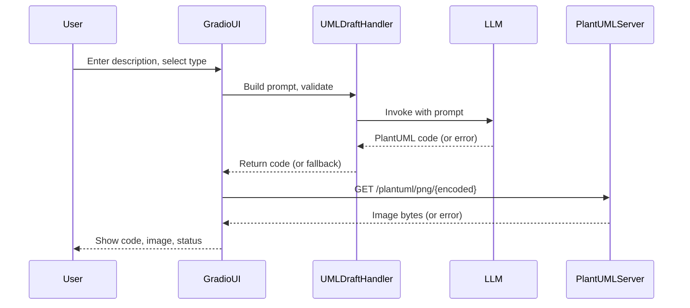

# UML Diagram Rendering Workflow

This section describes the end-to-end workflow for rendering UML diagrams in the Gradio-based Design Drafter UI, including PlantUML code generation, encoding, server communication, image rendering, and error handling.

---

## 1. PlantUML Code Generation

- **User Input:**  
  The user provides a free-text description and selects a UML diagram type (and optionally a theme) in the Gradio UI.

- **Prompt Construction:**  
  The [`UMLDraftHandler`](../Design_Drafter/uml_draft_handler.py) loads a prompty template and fills in variables (`diagram_type`, `description`, `theme`).  
  - The template is validated for required placeholders.
  - If the template or variables are invalid, a `ValueError` is raised.

- **LLM Invocation:**  
  The handler invokes the configured LLM (e.g., OpenAI via LangChain) with the constructed prompt.
  - On LLM errors (e.g., API failure, invalid response), a fallback PlantUML stub is generated and an error message is set for the UI.

## 2. PlantUML Code Encoding and Server Request

- **Encoding:**  
  The generated PlantUML code is URL-encoded using `urllib.parse.quote`.

- **Image URL Construction:**  
  The encoded string is inserted into a PlantUML server URL template (e.g., `https://www.plantuml.com/plantuml/png/{encoded}`).

- **Image Fetch:**  
  The app sends an HTTP GET request to the PlantUML server to retrieve the rendered diagram image.
  - If the request fails (network error, timeout, non-200 response), the error is appended to the UI status message.

## 3. UI Rendering and Error Handling

- **Image Rendering:**  
  If the image is successfully fetched, it is loaded as a PIL Image and displayed in the Gradio UI alongside the generated PlantUML code.

- **Error Handling:**  
  - **LLM/Prompt Errors:**  
    - The UI displays a fallback PlantUML stub and a status message indicating the LLM error.
  - **PlantUML Server/Image Fetch Errors:**  
    - The UI displays the PlantUML code, but the image preview is blank or missing.
    - The status message includes details of the fetch failure.
  - **Image Conversion Errors:**  
    - If the image cannot be converted to a valid format, the UI shows a status message with the conversion error.

- **Status Messaging:**  
  All errors and status updates are surfaced to the user via a Markdown status area in the UI, ensuring transparency for debugging and user feedback.

---

## Summary Diagram

---

## References

- [app/gradio_app.py](../app/gradio_app.py)
- [Design_Drafter/uml_draft_handler.py](../Design_Drafter/uml_draft_handler.py)
- [assets/uml_diagram.prompty](../assets/uml_diagram.prompty)
