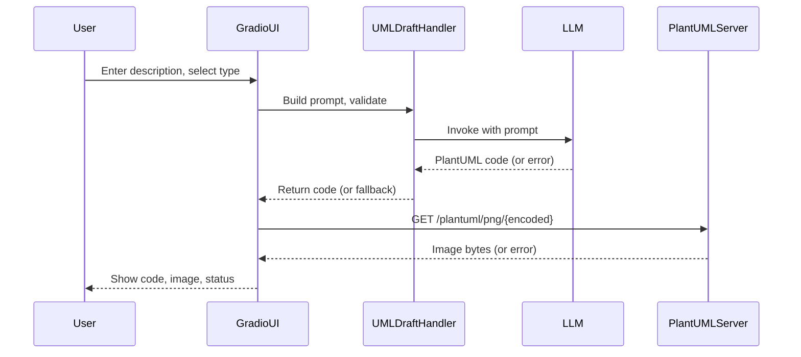

# UML Diagram Rendering & Chat-Based Revision Workflow

This section describes the end-to-end workflow for rendering and revising UML diagrams in the Gradio-based UMLBot UI, including chat-based iterative refinement, PlantUML code generation, encoding, server communication, image rendering, and error handling.

---

## Chat-Based UML Revision & Error Correction Workflow

- **Conversational Revision:**
  Users interact with the system via a chat interface, describing the desired system, requesting changes, or asking for corrections in natural language.
- **Iterative Updates:**
  Each chat message triggers prompt construction, LLM invocation, and diagram/code update. Users can request additions, removals, or clarifications at any step.
- **Error Handling & Auto-Correction:**
  If an error occurs (e.g., invalid UML, rendering failure), the system:
  - Surfaces a clear, actionable error message in the chat/status area.
  - Attempts to auto-correct the issue using LLM-based repair strategies.
  - Provides fallback PlantUML code or diagrams if correction fails.
- **Transparency:**
  All status updates, errors, and corrections are visible in the chat, ensuring users understand what went wrong and how it was addressed.

---

## 1. PlantUML Code Generation

- **User Input:**  
  The user provides a free-text description and selects a UML diagram type (and optionally a theme) in the Gradio UI.

- **Prompt Construction:**  
  The [`UMLDraftHandler`](UMLBot/uml_draft_handler.md) loads a prompty template and fills in variables (`diagram_type`, `description`, `theme`).  
  - The template is validated for required placeholders.
  - If the template or variables are invalid, a `ValueError` is raised.

- **LLM Invocation:**  
  The handler invokes the configured LLM (e.g., OpenAI via LangChain) with the constructed prompt.
  - On LLM errors (e.g., API failure, invalid response), a fallback PlantUML stub is generated and an error message is set for the UI.

## 2. PlantUML Code Encoding and Server Request

- **Encoding:**  
  The generated PlantUML code is URL-encoded using `urllib.parse.quote`.

- **Image URL Construction:**  
  The encoded string is inserted into a PlantUML server URL template (e.g., `http://localhost:8080/svg/{encoded}`).

- **Image Fetch:**  
  The app sends an HTTP GET request to the PlantUML server to retrieve the rendered diagram image.
  - If the request fails (network error, timeout, non-200 response), the error is appended to the UI status message.

## 3. UI Rendering and Error Handling

- **Image Rendering:**
  If the image is successfully fetched, it is loaded as a PIL Image and displayed in the Gradio UI alongside the generated PlantUML code.

- **Error Handling in Chat Workflow:**
  - **LLM/Prompt Errors:**
    - The UI displays a fallback PlantUML stub and a status message indicating the LLM error in the chat/status area.
  - **PlantUML Server/Image Fetch Errors:**
    - The UI displays the PlantUML code, but the image preview is blank or missing.
    - The status message includes details of the fetch failure in the chat/status area.
  - **Image Conversion Errors:**
    - If the image cannot be converted to a valid format, the UI shows a status message with the conversion error in the chat/status area.
  - **Auto-Correction:**
    - When possible, the system attempts to auto-correct errors and informs the user of the correction attempt and result.

- **Status Messaging:**
  All errors, corrections, and status updates are surfaced to the user via the chat and Markdown status area in the UI, ensuring transparency for debugging and user feedback.

---

## Summary Diagram

---

## References

- app/gradio_app.py
- UMLBot/uml_draft_handler.py
- assets/uml_diagram.prompty
